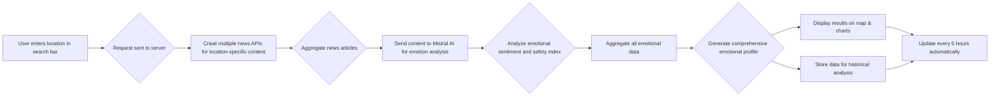
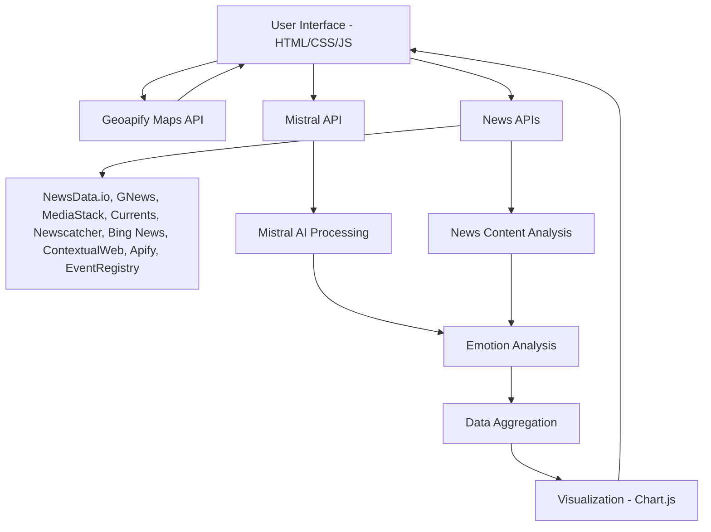

# City Emotional Map - Real-Time Mood Detection System

  

This application creates a real-time emotional map of Indian cities using Mistral AI, Geoapify maps, multiple news APIs, and data visualization.

## Features

- Interactive map with location search for Indian cities using Geoapify
- Real-time emotion analysis using Mistral AI
- News crawling from multiple news APIs (NewsData.io, GNews, MediaStack, Currents, Newscatcher, Bing News, ContextualWeb, Apify, EventRegistry)
- Data visualization with pie charts and bar graphs
- Safety index calculation
- Automatic updates every 6 hours
- Responsive and interactive UI with animations

## Setup Instructions

### Prerequisites

- Geoapify API key
- Mistral AI API key

### Configuration

1. Obtain a Geoapify API key from the [Geoapify website](https://www.geoapify.com/)
2. Obtain a Mistral AI API key
3. Obtain API keys for news services (optional but recommended):
   - NewsData.io API key
   - GNews API key
   - MediaStack API key
   - Currents API key
   - Newscatcher API key
   - Bing News API key
   - ContextualWeb API key
   - Apify API key
   - EventRegistry API key
4. Update the API keys in the following files:
   - `api-config.js` - Update all API keys in this centralized configuration file
   - `server.js` - Update news API keys in the NEWS_API_KEYS configuration
5. Install dependencies: `npm install`

### Running the Application

1. Save all files to a local directory
2. Install dependencies: `npm install`
3. Start the server: `node server.js`
4. Open `index.html` in a web browser (make sure to serve it through a local web server, not directly from file system due to CORS restrictions)
5. Enter an Indian city name in the search bar
6. View the emotional analysis results on the map and charts

## Files Structure

- `index.html` - Main HTML structure
- `styles.css` - Styling and animations
- `app.js` - Core application logic and map functionality
- `mistral-api.js` - Mistral AI integration
- `crawler.js` - News crawling functionality
- `visualization.js` - Data visualization components
- `data-integration.js` - Data integration services
- `main-integration.js` - Orchestrates all components
- `api-config.js` - Centralized API configuration
- `server.js` - Backend server with news API integrations
- `package.json` - Project dependencies and configuration

## How It Works

1. User enters a location in the search bar
2. The system crawls multiple news APIs for location-specific content
3. Mistral AI analyzes the content for emotional sentiment
4. Results are displayed on the map and in data visualization charts
5. Data is stored for historical analysis
6. The system updates automatically every 6 hours

## System Architecture

## Technology Stack

### Programming Languages
-  JavaScript (ES6+)
-  Node.js
-  HTML5
-  CSS3

### Frontend
-  HTML5
-  CSS3
-  JavaScript (ES6+)
- Leaflet.js with Geoapify
- Chart.js

### Backend
-  Node.js
-  Express.js
- Axios (HTTP client)

### AI & Analytics
- Google Gemini AI (gemini-2.0-flash-exp)
- Emotion Analysis Algorithms
- Multimodal Analysis (Text + Images)

### News APIs
- NewsData.io API
- GNews API
- MediaStack API
- Currents API
- Newscatcher API
- Bing News API
- ContextualWeb API
- Apify API
- EventRegistry API

### Mapping Services
- Geoapify
- Leaflet.js

### Other Technologies
- Responsive design with CSS Grid and Flexbox

## Privacy and Ethics

This system is designed to analyze publicly available information only. All data processing respects privacy regulations and ethical guidelines for AI usage.